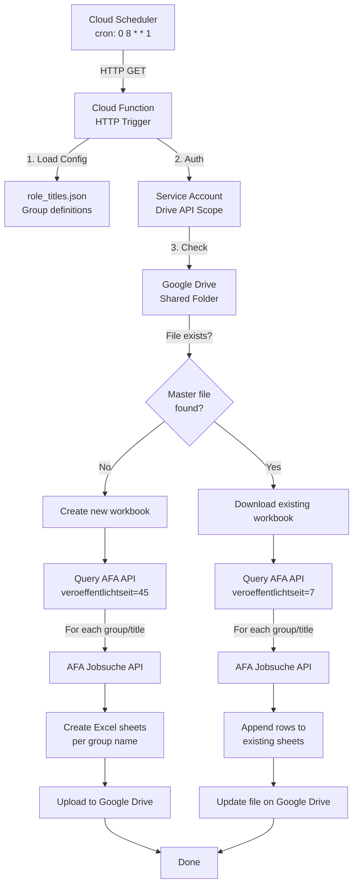

# Cloud Function: Weekly AFA Job Scraper

## Overview

A GCP Cloud Function that runs weekly to scrape job listings from the **Bundesagentur für Arbeit (AFA)** API, based on configurable role title groups. Results are stored in an Excel workbook hosted on **Google Drive**, enabling incremental appends.

## Architecture Diagram



## Components

### 1. Cloud Function Entry Point (`main.py`)
- **Trigger:** HTTP (via Cloud Scheduler)
- **Entry point:** `main(request)` function
- **Flow:**
  1. Load configuration from `config/role_titles.json`
  2. Initialize Google Drive client
  3. Check for master Excel file in shared Drive folder
  4. Branch: create new or append to existing workbook
  5. Query AFA API for each role title
  6. Write results to Excel
  7. Upload/update file on Google Drive

### 2. Google Drive Client (`drive_client.py`)
- **Auth:** Service account with `drive.file` scope
- **Operations:**
  - `file_exists(folder_id, filename)` — checks if master file exists
  - `download_file(file_id)` — downloads Excel file as bytes
  - `create_file(folder_id, filename, content)` — uploads new file
  - `update_file(file_id, content)` — overwrites existing file
- **Credential source:** Environment variable `GOOGLE_APPLICATION_CREDENTIALS` or Secret Manager

### 3. AFA Job Scraper (`job_scraper.py`)
- **Endpoint:** `https://rest.arbeitsagentur.de/jobboerse/jobsuche-service/pc/v4/app/jobs`
- **Parameters:**
  - `was`: Role title (search query)
  - `angebotsart`: 1 (regular employment)
  - `arbeitszeit`: vz (full-time)
  - `veroeffentlichtseit`: 45 (initial) or 7 (subsequent)
  - `size`: 50 (max results per page)
- **Deduplication:** Tracks `refnr` (reference number) across all queries to avoid duplicates
- **Output:** List of dicts with fields: `search_term`, `titel`, `arbeitgeber`, `ort`, `refnr`, `eintrittsdatum`, `url`

### 4. Excel Generator (`excel_generator.py`)
- **Library:** openpyxl (supports reading and modifying existing workbooks)
- **Columns:**
  | Column | Header | Source |
  |--------|--------|--------|
  | A | Role Title | Search query phrase |
  | B | Job Title | `job.titel` |
  | C | Company Name | `job.arbeitgeber` |
  | D | Location | `job.arbeitsort.ort` |
  | E | Salary Range | N/A (not available from API) |
  | F | Link | Constructed URL from `refnr` |
  | G | Job ID | `job.refnr` |
  | H | Posted Date | `job.eintrittsdatum` |
- **Sheet naming:** Per group name from config (e.g., "Radar Engineers")
- **Header styling:** Bold, frozen first row, auto-filter
- **Append mode:** Checks existing `refnr` values to prevent duplicates

### 5. Configuration (`config/role_titles.json`)
- **Structure:**
  ```json
  {
    "drive_folder_id": "SHARED_FOLDER_ID",
    "master_file_name": "job_listings_master.xlsx",
    "groups": [
      {
        "name": "Group Display Name",
        "titles": ["title1", "title2"]
      }
    ]
  }
  ```

## Data Flow

### Initial Run (No master file)
```
Cloud Scheduler triggers → main()
  → Load config/role_titles.json
  → Check Drive: file not found
  → Set time_period = 45
  → For each group:
      For each title in group.titles:
        Query AFA API (veroeffentlichtseit=45)
        Collect results, deduplicate by refnr
        Create sheet named group.name
        Write header + data rows
  → Upload new Excel file to Drive
```

### Subsequent Runs (Master file exists)
```
Cloud Scheduler triggers → main()
  → Load config/role_titles.json
  → Check Drive: file found → download
  → Set time_period = 7
  → Load existing data, collect all refnrs for dedup
  → For each group:
      For each title in group.titles:
        Query AFA API (veroeffentlichtseit=7)
        Filter out already-seen refnrs
        Append new rows to group sheet
  → Upload updated Excel file to Drive
```

## Scheduling

- **Frequency:** Weekly (every Monday at 08:00 Berlin time)
- **Trigger:** Cloud Scheduler → HTTP GET
- **Cron:** `0 8 * * 1`
- **Timezone:** Europe/Berlin
- **Retry:** Cloud Scheduler retries on failure (configurable)

## Security

- **Service Account:** Dedicated SA with minimal permissions
- **Drive Scope:** `drive.file` (only files explicitly shared with SA)
- **Credentials:** Stored in GCP Secret Manager, injected as env var
- **API Key:** Uses public `jobboerse-jobsuche` key (same as existing scraper)

## Dependencies

```
google-api-python-client>=2.0.0
google-auth>=2.0.0
openpyxl>=3.0.0
requests>=2.28.0
```

## Deployment

```bash
# Deploy Cloud Function (v2, HTTP trigger)
gcloud functions deploy weekly-job-scraper \
    --runtime python312 \
    --trigger-http \
    --entry-point main \
    --source cloud-function/ \
    --region europe-west1 \
    --service-account "scraper-sa@PROJECT.iam.gserviceaccount.com" \
    --set-secrets "SERVICE_ACCOUNT_JSON=sa-key:latest" \
    --timeout 540s \
    --memory 512MB

# Create Cloud Scheduler job
gcloud scheduler jobs create http weekly-job-scraper \
    --schedule="0 8 * * 1" \
    --uri="https://europe-west1-PROJECT.cloudfunctions.net/weekly-job-scraper" \
    --http-method=GET \
    --time-zone="Europe/Berlin" \
    --oidc-service-account-email="scheduler-sa@PROJECT.iam.gserviceaccount.com" \
    --oidc-token-audience="https://europe-west1-PROJECT.cloudfunctions.net/weekly-job-scraper"
```

## Limitations

1. **No salary data** — The AFA public API does not expose per-job salary amounts. The Salary Range column will show "N/A".
2. **Max 50 results per query** — The API returns max 50 results per request. Pagination is not yet implemented.
3. **Rate limiting** — A 1-second delay between API calls is applied.
