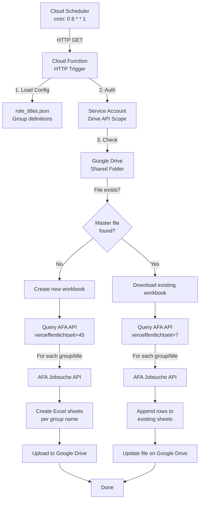

# Cloud Function: Weekly AFA Job Scraper

> **Status:** implemented. This note was written against the original design and
> described the `/pc/v4/app/jobs` endpoint, a 50-result page limit and no salary
> data. All three are now outdated: AFA retires `v2`/`v4` (they return HTTP 403
> for every request) and only `/pc/v6/jobs` is served. The sections below have
> been corrected; see `docs/DEVELOPER_GUIDE.md` for the current API contract.

## Overview

A GCP Cloud Function that runs weekly to scrape job listings from the **Bundesagentur für Arbeit (AFA)** API, based on configurable role title groups. Results are stored in an Excel workbook hosted on **Google Drive**, enabling incremental appends.

## Architecture Diagram



## Components

### 1. Cloud Function Entry Point (`main.py`)
- **Trigger:** HTTP (via Cloud Scheduler)
- **Entry point:** `main(request)` function
- **Flow:**
  1. Load configuration from `config/role_titles.json`
  2. Initialize Google Drive client
  3. Check for master Excel file in shared Drive folder
  4. Branch: create new or append to existing workbook
  5. Query AFA API for each role title
  6. Write results to Excel
  7. Upload/update file on Google Drive

### 2. Google Drive Client (`drive_client.py`)
- **Auth:** Service account with `drive.file` scope
- **Operations:**
  - `file_exists(folder_id, filename)` — checks if master file exists
  - `download_file(file_id)` — downloads Excel file as bytes
  - `create_file(folder_id, filename, content)` — uploads new file
  - `update_file(file_id, content)` — overwrites existing file
- **Credential source:** Environment variable `GOOGLE_APPLICATION_CREDENTIALS` or Secret Manager

### 3. AFA Job Scraper (`job_scraper.py`)
- **Endpoint:** `https://rest.arbeitsagentur.de/jobboerse/jobsuche-service/pc/v6/jobs`
  (the `v2`/`v4` paths are retired and answer HTTP 403 for every request)
- **Parameters:**
  - `was`: Role title (search query)
  - `angebotsart`: 1 (regular employment)
  - `arbeitszeit`: vz (full-time)
  - `veroeffentlichtseit`: 45 (initial) or the checkpoint-derived window (subsequent), capped at 100
  - `page`: 1-based page number
  - `size`: 100 (the API's hard maximum; larger values return HTTP 400)
- **Pagination:** all pages are fetched via `maxErgebnisse`, so no results are silently dropped
- **Retries:** only transient statuses (408/425/429/5xx) are retried, 3 attempts with backoff. A 401/403 raises `AuthError` immediately because it means the endpoint path or API key is wrong
- **Deduplication:** Tracks `refnr` (reference number) across all queries to avoid duplicates
- **Output:** List of dicts with fields: `search_term`, `titel`, `arbeitgeber`, `ort`, `gehalt`, `refnr`, `eintrittsdatum`, `veroeffentlichungsdatum`, `url`

### 4. Excel Generator (`excel_generator.py`)
- **Library:** openpyxl (supports reading and modifying existing workbooks)
- **Columns:**
  | Column | Header | Source |
  |--------|--------|--------|
  | A | Role Title | Search query phrase |
| B | Job Title | `stellenangebotsTitel` |
| C | Company Name | `firma` |
| D | Location | `stellenlokationen[0].adresse.ort` |
| E | Salary Range | `gehaltsspanneVon`/`gehaltsspanneBis` + `verguetungsangabe`, else `N/A` |
| F | Link | Constructed URL from `refnr` |
| G | Job ID | `referenznummer` |
| H | Start Date | `eintrittszeitraum.von` |
| I | Posted Date | `datumErsteVeroeffentlichung` |
- **Sheet naming:** Per group name from config (e.g., "Radar Engineers")
- **Header styling:** Bold, frozen first row, auto-filter spanning the header *and* data rows
- **Append mode:** Checks existing `refnr` values to prevent duplicates

### 5. Configuration (`config/role_titles.json`)
- **Structure:**
  ```json
  {
    "drive_folder_id": "SHARED_FOLDER_ID",
    "master_file_name": "job_listings_master.xlsx",
    "groups": [
      {
        "name": "Group Display Name",
        "titles": ["title1", "title2"]
      }
    ]
  }
  ```

## Data Flow

### Initial Run (No master file)
```
Cloud Scheduler triggers → main()
  → Load config/role_titles.json
  → Check Drive: file not found
  → Set time_period = 45
  → For each group:
      For each title in group.titles:
        Query AFA API (veroeffentlichtseit=45)
        Collect results, deduplicate by refnr
        Create sheet named group.name
        Write header + data rows
  → Upload new Excel file to Drive
```

### Subsequent Runs (Master file exists)
```
Cloud Scheduler triggers → main()
  → Load config/role_titles.json
  → Check Drive: file found → download
  → Set time_period = 7
  → Load existing data, collect all refnrs for dedup
  → For each group:
      For each title in group.titles:
        Query AFA API (veroeffentlichtseit=7)
        Filter out already-seen refnrs
        Append new rows to group sheet
  → Upload updated Excel file to Drive
```

## Scheduling

- **Frequency:** Weekly (every Monday at 08:00 Berlin time)
- **Trigger:** Cloud Scheduler → HTTP GET
- **Cron:** `0 8 * * 1`
- **Timezone:** Europe/Berlin
- **Retry:** Cloud Scheduler retries on failure (configurable)

## Security

- **Service Account:** Dedicated SA with minimal permissions
- **Drive Scope:** `drive.file` — the app can only see files it created, so the workbook must be created by the first run (or widen the scope to `/auth/drive`)
- **Credentials:** Application Default Credentials. On GCP the runtime SA is used via the metadata server — no key file or Secret Manager entry is needed. An optional inline `SERVICE_ACCOUNT_JSON` env var is still honoured for local `RUN_ENV=gcp` runs
- **API Key:** Uses public `jobboerse-jobsuche` key (same as existing scraper). A missing key also produces HTTP 403, which is why 403 is treated as a configuration error rather than a transient failure

## Dependencies

```
google-api-python-client>=2.0.0
google-auth>=2.0.0
openpyxl>=3.0.0
requests>=2.28.0
```

## Deployment

```bash
# Deploy Cloud Function (v2, HTTP trigger)
# Set RUN_ENV=gcp so the deployed build writes to Drive instead of ./output/.
gcloud functions deploy weekly-job-scraper \
    --gen2 \
    --runtime python312 \
    --trigger-http \
    --entry-point main \
    --source cloud-function/ \
    --region europe-west1 \
    --service-account "scraper-sa@PROJECT.iam.gserviceaccount.com" \
    --set-env-vars "RUN_ENV=gcp,DRIVE_FOLDER_ID=YOUR_GOOGLE_DRIVE_FOLDER_ID" \
    --timeout 540s \
    --memory 512MB \
    --no-allow-unauthenticated

# Create Cloud Scheduler job
gcloud scheduler jobs create http weekly-job-scraper \
    --schedule="0 8 * * 1" \
    --uri="https://europe-west1-PROJECT.cloudfunctions.net/weekly-job-scraper" \
    --http-method=GET \
    --time-zone="Europe/Berlin" \
    --oidc-service-account-email="scheduler-sa@PROJECT.iam.gserviceaccount.com" \
    --oidc-token-audience="https://europe-west1-PROJECT.cloudfunctions.net/weekly-job-scraper"
```

## Limitations

1. **Sparse salary data** — employers rarely publish pay through this API (roughly 20–25 % of postings in a typical run). The Salary Range column shows `N/A` for the rest.
2. **100 results per page** — the API's hard limit. All pages are fetched, so no results are dropped, but each extra page costs a rate-limited request.
3. **Rate limiting** — a 1-second delay between API calls is applied.
4. **Single writer** — concurrent runs would race on the same workbook, so the deployment caps concurrency at one instance.
