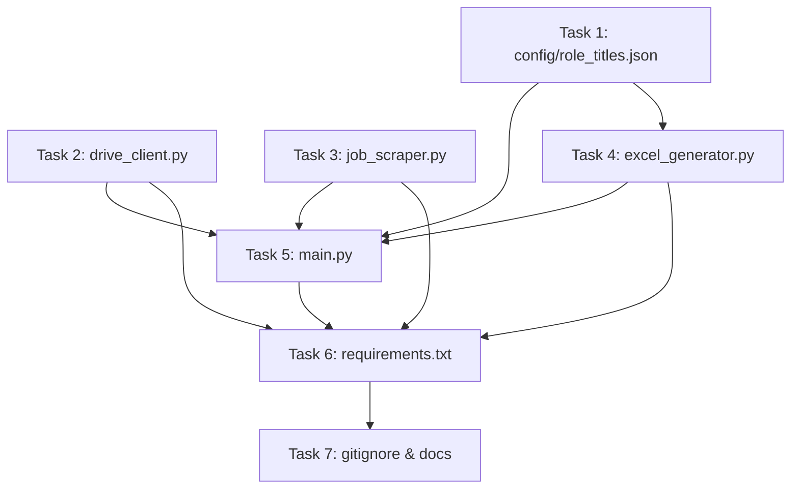

# Implementation Plan: Weekly AFA Job Scraper Cloud Function

> **Status: historical.** This is the plan as originally written and it records the
> `/pc/v4/app/jobs` endpoint, which AFA has since retired (it now returns HTTP 403
> for every request). The shipped code uses `/pc/v6/jobs`. Treat the current source
> and `docs/` as authoritative:
>
> - `docs/DEPLOYMENT.md` — Cloud Run + Scheduler
> - `docs/USER_GUIDE.md` — running it, output format
> - `docs/DEVELOPER_GUIDE.md` — API contract, module design, tests

## Overview

This plan breaks down the implementation of a GCP Cloud Function that scrapes the Bundesagentur für Arbeit (AFA) job API on a weekly schedule, storing results in a Google Drive-hosted Excel workbook.

**Architecture Reference:** `architecture/design-docs/cloud-function-afa-weekly-scraper.md`

---

## Task List

### Task 1: Create Configuration File (`config/role_titles.json`)

**Description:** Create the JSON configuration file that defines:
- `drive_folder_id`: The ID of the shared Google Drive folder
- `master_file_name`: The name of the Excel file (e.g., `job_listings_master.xlsx`)
- `groups`: An array of groups, each with a `name` (used as sheet name) and `titles` (array of search phrases)

**Dependencies:** None

**Expected Output:** File `cloud-function/config/role_titles.json` with a well-documented structure and example groups.

---

### Task 2: Implement Google Drive Client (`drive_client.py`)

**Description:** Implement a Python module that wraps the Google Drive API v3 for the following operations:
- Authenticate using a service account (credentials from env var or default ADC)
- `file_exists(folder_id, filename)` → checks if a file exists by name in a specific folder
- `download_file(file_id)` → downloads file content as bytes
- `create_file(folder_id, filename, content_bytes)` → uploads a new file
- `update_file(file_id, content_bytes)` → overwrites an existing file

**Key Requirements:**
- Use `google.oauth2.service_account.Credentials` with `https://www.googleapis.com/auth/drive.file` scope
- Use `googleapiclient.discovery.build('drive', 'v3', ...)`
- Handle the case where the service account JSON key is passed via env var `SERVICE_ACCOUNT_JSON`

**Dependencies:** None (first module to implement)

**Expected Output:** File `cloud-function/drive_client.py` with a `DriveClient` class or module-level functions.

---

### Task 3: Implement AFA Job Scraper (`job_scraper.py`)

**Description:** Enhance the existing scraper logic into a reusable module that:
- Queries the AFA API for a single search phrase with configurable time period
- Accepts a time period parameter (`veroeffentlichtseit`: 7 or 45 days)
- Returns structured job records with fields: `search_term`, `titel`, `arbeitgeber`, `ort`, `refnr`, `eintrittsdatum`, `url`
- Includes a 1-second delay between calls for rate limiting

**API Details:**
- URL: `https://rest.arbeitsagentur.de/jobboerse/jobsuche-service/pc/v6/jobs` (the `v2`/`v4` paths are retired and return HTTP 403)
- Headers: `X-API-Key: jobboerse-jobsuche`
- Params: `was=<phrase>`, `angebotsart=1`, `arbeitszeit=vz`, `veroeffentlichtseit=<days>`, `page=<n>`, `size=100` (the API's hard maximum)

**Dependencies:** None

**Expected Output:** File `cloud-function/job_scraper.py` with a `search_jobs(phrase, days)` function.

---

### Task 4: Implement Excel Generator (`excel_generator.py`)

**Description:** Implement a module for creating and updating Excel workbooks using openpyxl:
- `create_new_workbook(groups_data)` → creates a new workbook with:
  - One sheet per group, named after the group
  - Header row: Role Title, Job Title, Company Name, Location, Salary Range, Link, Job ID, Start Date, Posted Date
  - Bold headers, frozen first row, auto-filter enabled **across the data rows, not just row 1**
- `append_to_workbook(workbook_bytes, groups_data)` → loads existing workbook and appends new rows:
  - Deduplicates by `refnr` (check existing refnrs in sheet before appending)
  - Appends to the correct sheet based on group name
- `workbook_to_bytes(workbook)` → saves workbook to BytesIO for upload

**Key Requirements:**
- Must handle both creating new and appending to existing workbooks
- Deduplication must be robust (track refnrs per sheet)
- Salary Range is rendered from `gehaltsspanneVon`/`gehaltsspanneBis` plus `verguetungsangabe`, falling back to "N/A" when the employer published no figure

**Dependencies:** None

**Expected Output:** File `cloud-function/excel_generator.py` with `create_new_workbook()` and `append_to_workbook()` functions.

---

### Task 5: Implement Cloud Function Entry Point (`main.py`)

**Description:** Implement the HTTP-triggered Cloud Function entry point that orchestrates the entire workflow:

```
main(request) →
  1. Load config/role_titles.json
  2. Initialize DriveClient
  3. Check if master file exists in Drive
  4. If NOT exists:
     a. For each group, for each title: query AFA (45 days)
     b. Create new Excel workbook
     c. Upload to Drive
  5. If EXISTS:
     a. Download workbook from Drive
     b. For each group, for each title: query AFA (7 days)
     c. Append new results to workbook
     d. Upload updated workbook to Drive
  6. Return success/error response
```

**Key Requirements:**
- Flush prints for Cloud Function logging (`print(..., flush=True)`)
- Handle errors gracefully, return meaningful HTTP responses
- Log progress at key steps
- Support `SERVICE_ACCOUNT_JSON` env var for Drive auth

**Dependencies:** Task 2 (drive_client.py), Task 3 (job_scraper.py), Task 4 (excel_generator.py), Task 1 (config)

**Expected Output:** File `cloud-function/main.py`.

---

### Task 6: Create `requirements.txt`

**Description:** Create the Python dependencies file for the Cloud Function.

**Dependencies:** Tasks 2-5 (to know which packages are imported)

**Expected Output:** File `cloud-function/requirements.txt` with:
```
google-api-python-client>=2.0.0
google-auth>=2.0.0
openpyxl>=3.0.0
requests>=2.28.0
```

---

### Task 7: Update `.gitignore` and Documentation

**Description:** 
- Update `.gitignore` to exclude generated Excel files and service account keys
- Add a README section for the cloud function

**Dependencies:** Tasks 1-6

**Expected Output:** Updated `.gitignore` and optionally `cloud-function/README.md`.

---

## Task Dependencies



## Execution Order

1. **Task 1** (config) — No dependencies, can start first
2. **Task 2** (drive_client) — No dependencies, can start first
3. **Task 3** (job_scraper) — No dependencies, can start first
4. **Task 4** (excel_generator) — No dependencies, can start first
5. **Task 5** (main.py) — Depends on Tasks 1-4
6. **Task 6** (requirements.txt) — Depends on Tasks 2-5
7. **Task 7** (gitignore) — Depends on all tasks
