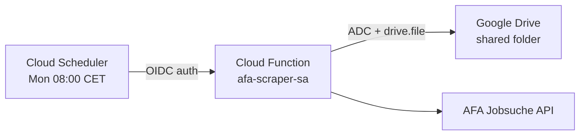

# Deploying the AFA Job Scraper to GCP

## Prerequisites

- [Google Cloud SDK](https://cloud.google.com/sdk/docs/install) installed and authenticated
- A GCP project with billing enabled
- Required APIs enabled:
  ```
  gcloud services enable cloudfunctions.googleapis.com
  gcloud services enable cloudscheduler.googleapis.com
  gcloud services enable drive.googleapis.com
  ```

## 1. Configure Settings

Edit `config/role_titles.json`:

1. Create a folder in Google Drive and copy its **folder ID** (the long string in the URL: `https://drive.google.com/drive/folders/THIS_IS_THE_ID`)
2. Set `"drive_folder_id"` to that ID
3. Customize the `"groups"` and their role titles as needed


## 2. Create Service Accounts

Two SAs are needed — one **runtime** SA for the function, and one **scheduler** SA for triggering it.

```bash
# --- Function runtime SA ---
gcloud iam service-accounts create afa-scraper-sa \
    --display-name="AFA Job Scraper Runtime"

# --- Cloud Scheduler SA (for triggering the function) ---
gcloud iam service-accounts create afa-scheduler-sa \
    --display-name="AFA Job Scraper Scheduler"
```

## 3. Grant Minimal Permissions

### 3a. Share the Drive Folder

1. Note the runtime SA email:
   ```bash
   gcloud iam service-accounts list --filter="name:afa-scraper-sa"
   ```
2. In Google Drive, right-click your folder → **Share**
3. Add the runtime SA email as **Editor**

The `drive.file` OAuth scope in the code restricts access to only files this SA creates or is explicitly shared with — so folder-level Editor is the only grant needed.

### 3b. Grant Scheduler SA invoke permission on the function

Run this **after** deploying the function (step 5):
```bash
gcloud functions add-iam-policy-binding weekly-job-scraper \
    --region europe-west1 \
    --member="serviceAccount:afa-scheduler-sa@YOUR_PROJECT_ID.iam.gserviceaccount.com" \
    --role="roles/cloudfunctions.invoker"
```

## 4. Deploy the Cloud Function

The runtime SA inherits credentials from the GCP metadata server automatically — no key file or Secret Manager needed.

```bash
# From the cloud-function/ directory
gcloud functions deploy weekly-job-scraper \
    --runtime python312 \
    --trigger-http \
    --entry-point main \
    --source . \
    --region europe-west1 \
    --service-account afa-scraper-sa@YOUR_PROJECT_ID.iam.gserviceaccount.com \
    --timeout 540s \
    --memory 512MB \
    --no-allow-unauthenticated
```

## 5. Create the Weekly Schedule

```bash
# Get the function URL
FUNC_URL=$(gcloud functions describe weekly-job-scraper \
    --region europe-west1 \
    --format="value(serviceConfig.uri)")

# Create the Cloud Scheduler job (runs every Monday at 08:00 Berlin)
gcloud scheduler jobs create http weekly-job-scraper \
    --schedule="0 8 * * 1" \
    --uri="$FUNC_URL" \
    --http-method=GET \
    --time-zone="Europe/Berlin" \
    --oidc-service-account-email="afa-scheduler-sa@YOUR_PROJECT_ID.iam.gserviceaccount.com" \
    --oidc-token-audience="$FUNC_URL"
```

## 6. Test the Function

### Trigger manually via gcloud:
```bash
gcloud functions call weekly-job-scraper --region europe-west1
```

### View logs:
```bash
gcloud functions logs read weekly-job-scraper --region europe-west1 --limit 50
```

---

## Local Development

Run the scraper **without** any GCP or Drive access — just set `RUN_ENV = "local"` at the top of `main.py` (default) and run:

```bash
cd cloud-function/
pip install -r requirements.txt
python main.py
```

Or simulate the Cloud Functions HTTP runtime:
```bash
pip install functions-framework
functions-framework --target main --debug --port 8080
# curl http://localhost:8080
```

In local mode:
- Excel files are saved to `./output/` instead of Google Drive
- No service account, no Drive API, no GCP needed
- The `drive_folder_id` in config is ignored

### Local file lifecycle

| Run # | Behavior |
|-------|----------|
| 1st | Creates `output/job_listings_master.xlsx` with **45-day** data |
| 2nd+ | Appends **7-day** data to the existing file |
| Delete the file to restart the cycle |

---

## Architecture Overview



## Troubleshooting

| Problem | Check |
|---------|-------|
| `PERMISSION_DENIED` on Drive | Ensure the folder is shared with the runtime SA email as **Editor** |
| Function timeout | Increase `--timeout` (default 60s, we use 540s) |
| `PERMISSION_DENIED` invoking function | Run step 3b to grant `roles/cloudfunctions.invoker` to the scheduler SA |
