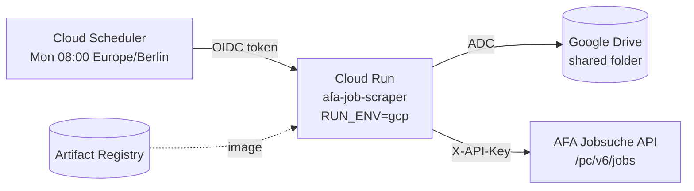

# Deployment Guide — AFA Job Scraper on Google Cloud

How to build the container, push it, and run it as a scheduled service on
Google Cloud. Everything here was verified on an Apple Silicon Mac against
`europe-west1`.

> **One codebase, two modes.** The same container runs locally (`RUN_ENV=local`,
> writes `./output/`) and on GCP (`RUN_ENV=gcp`, writes Google Drive). The mode is
> chosen by build arg / environment variable — never by editing source. See
> [DEVELOPER_GUIDE.md](./DEVELOPER_GUIDE.md) for the full picture.

---

## 1. What gets deployed



A single Cloud Run service, triggered by Cloud Scheduler. Each invocation either
creates or appends to one workbook in a shared Drive folder.

**Recommended runtime settings**

| Setting | Value | Why |
|---|---|---|
| Platform | `linux/amd64` | GCP does not run arm64 images |
| Memory | 512 MiB | Comfortable for a 250-row workbook |
| Timeout | 900 s | ~30 s per run today, but leaves headroom for retries |
| Max instances | 1 | Two concurrent runs would race on the same workbook |
| Authentication | `--no-allow-unauthenticated` | Only Cloud Scheduler should invoke it |

---

## 2. Prerequisites

```bash
gcloud --version          # Cloud SDK installed
gcloud auth login
gcloud config set project YOUR_PROJECT_ID

# Required APIs
gcloud services enable \
    run.googleapis.com \
    cloudbuild.googleapis.com \
    artifactregistry.googleapis.com \
    cloudscheduler.googleapis.com \
    drive.googleapis.com
```

A Google Drive folder that will hold the workbook, and a GCP project with
billing enabled.

---

## 3. Service accounts

Two service accounts: one for the running service, one for the scheduler.

```bash
PROJECT_ID=YOUR_PROJECT_ID
REGION=europe-west1

# Runtime SA — owns the Drive folder access
gcloud iam service-accounts create afa-scraper-sa \
    --display-name="AFA Job Scraper Runtime"

# Scheduler SA — allowed to invoke the service
gcloud iam service-accounts create afa-scheduler-sa \
    --display-name="AFA Job Scraper Scheduler"
```

### 3a. Share the Drive folder with the runtime SA

```bash
gcloud iam service-accounts list --filter="email:afa-scraper-sa"
# -> afa-scraper-sa@YOUR_PROJECT_ID.iam.gserviceaccount.com
```

In Google Drive: right-click the target folder → **Share** → paste the runtime SA
email → **Editor**.

> **Important — let the app create the workbook.**
> `drive_client.py` requests the `drive.file` scope, which grants the service
> account access only to files *the app itself* created. If you manually upload a
> pre-existing `job_listings_master.xlsx`, the app will not see it and will create
> a second file. Either let the first run create the workbook, or widen the scope
> to `https://www.googleapis.com/auth/drive` in `drive_client.py`.

---

## 4. Build the image (Cloud Build)

Cloud Build compiles `linux/amd64` natively, so you do not hit the
architecture mismatch that local `docker build` produces on an M-series Mac.

```bash
REGION=europe-west1
IMAGE="$REGION-docker.pkg.dev/$PROJECT_ID/afa/afa-scraper:latest"

# One-time: a Docker repository to push into
gcloud artifacts repositories create afa \
    --repository-format=docker \
    --location=$REGION \
    --description="AFA job scraper images"

# Build from the Dockerfile in cloud-function/
cd cloud-function/
gcloud builds submit --tag "$IMAGE" .
```

`gcloud builds submit --tag` uses the `Dockerfile` in the source directory. The
build argument `RUN_ENV` defaults to `local` in the Dockerfile, but the
deployment in the next step overrides it — so the artefact itself stays neutral.

---

## 5. Deploy to Cloud Run

```bash
gcloud run deploy afa-job-scraper \
    --image "$IMAGE" \
    --region "$REGION" \
    --platform managed \
    --service-account "afa-scraper-sa@$PROJECT_ID.iam.gserviceaccount.com" \
    --no-allow-unauthenticated \
    --memory 512Mi \
    --cpu 1 \
    --timeout 900 \
    --max-instances 1 \
    --set-env-vars "RUN_ENV=gcp,DRIVE_FOLDER_ID=YOUR_GOOGLE_DRIVE_FOLDER_ID"
```

`DRIVE_FOLDER_ID` overrides `drive_folder_id` in `config/role_titles.json`, so the
image contains no environment-specific values.

Grab the service URL — you need it for the scheduler audience:

```bash
SERVICE_URL=$(gcloud run services describe afa-job-scraper \
    --region "$REGION" --format="value(status.url)")
echo "$SERVICE_URL"
```

---

## 6. Grant the scheduler permission to invoke

```bash
gcloud run services add-iam-policy-binding afa-job-scraper \
    --region "$REGION" \
    --member="serviceAccount:afa-scheduler-sa@$PROJECT_ID.iam.gserviceaccount.com" \
    --role="roles/run.invoker"
```

Without this, every scheduled call returns **HTTP 403**.

---

## 7. Schedule the weekly run

```bash
gcloud scheduler jobs create http afa-weekly-scrape \
    --location "$REGION" \
    --schedule "0 8 * * 1" \
    --time-zone "Europe/Berlin" \
    --uri "${SERVICE_URL}/" \
    --http-method POST \
    --oidc-service-account-email "afa-scheduler-sa@$PROJECT_ID.iam.gserviceaccount.com" \
    --oidc-token-audience "$SERVICE_URL" \
    --attempt-deadline 900s
```

`--oidc-token-audience` must be the service URL exactly (the bare root), or Cloud
Run rejects the token.

---

## 8. Verify the deployment

```bash
# Manual trigger through the scheduler's identity
gcloud scheduler jobs run afa-weekly-scrape --location "$REGION"

# Logs
gcloud run services logs read afa-job-scraper --region "$REGION" --limit 50
```

A healthy run ends with a log line like:

```
SUCCESS: Created 'job_listings_master.xlsx' with 245 jobs through 2026-09-29T11:10:44Z.
```

The response body is JSON so you can also inspect it directly:

```json
{"status": "ok", "message": "Appended 'job_listings_master.xlsx' with 7 fetched jobs through ..."}
```

| Outcome | Meaning |
|---|---|
| `Created ...` | First run; 4-week lookback, new workbook uploaded |
| `Appended ...` | Incremental; only new jobs added |
| `No jobs returned; checkpoint advanced` | Nothing new, checkpoint moved forward |
| `Drive folder ID not configured` | `DRIVE_FOLDER_ID` missing and config still holds the placeholder |
| `AFA authentication/endpoint error` | HTTP 401/403 from AFA — endpoint path or API key (see below) |

---

## 9. Alternative: Cloud Functions (2nd gen)

If you prefer a function over a service, the source-based path also works
because `main.py` still exposes `main(request)`:

```bash
gcloud functions deploy afa-job-scraper \
    --gen2 \
    --runtime python312 \
    --trigger-http \
    --entry-point main \
    --source . \
    --region "$REGION" \
    --service-account "afa-scraper-sa@$PROJECT_ID.iam.gserviceaccount.com" \
    --timeout 540s \
    --memory 512MB \
    --set-env-vars "RUN_ENV=gcp,DRIVE_FOLDER_ID=YOUR_GOOGLE_DRIVE_FOLDER_ID" \
    --no-allow-unauthenticated
```

Then grant `roles/cloudfunctions.invoker` to the scheduler SA and point
Cloud Scheduler at the function URI. Note that this path uses Cloud Buildpacks
(`requirements.txt`), not the `Dockerfile`.

---

## 10. Updating a deployed build

```bash
cd cloud-function/
gcloud builds submit --tag "$IMAGE" .
gcloud run deploy afa-job-scraper --image "$IMAGE" --region "$REGION"
```

`config/role_titles.json` is baked into the image, so changing groups/titles
requires a rebuild. To change them without a rebuild, mount the config from a
volume or move it to a Cloud Storage bucket.

---

## 11. Troubleshooting

| Symptom | Cause | Fix |
|---|---|---|
| `403` on every AFA request, empty body | Deprecated endpoint (`/pc/v4/...`, `/pc/v2/...`) or missing/invalid `X-API-Key` | Use `/pc/v6/jobs`; the constant is `SEARCH_PATH` in `job_scraper.py` |
| `400 EINGABEN_UNVOLLSTAENDIG` | `size` > 100 | `PAGE_SIZE = 100` in `job_scraper.py` |
| `PERMISSION_DENIED` reading/writing Drive | Folder not shared with the runtime SA, or the workbook was uploaded by a human and is invisible to the `drive.file` scope | Share the folder as **Editor**; let the app create the workbook |
| `403` invoking the service | Scheduler SA lacks `roles/run.invoker`, or the OIDC audience ≠ service URL | Re-run step 6; check `--oidc-token-audience` |
| `403` only from Cloud Run, but 200 locally | Possible outbound-IP rejection by the AFA edge. **Not reproduced in testing** — verified only from a residential Mac connection. | Route egress through a Serverless VPC connector + Cloud NAT with a non-datacenter IP, or run the container on your own host |
| Run exceeds the timeout | Slow AFA responses with retries | Raise `--timeout` (Cloud Run allows up to 3600 s) |
| Two files appear in Drive | A run was interrupted after upload, or a human-uploaded file is invisible to the scope | Keep `--max-instances 1`; see the `drive.file` note in step 3a |
| Container exits `RUN_ENV must be one of ('local', 'gcp')` | Typo in `RUN_ENV` | Fix the env var; valid values are exactly `local` and `gcp` |

---

## 12. Cost and cleanup

A weekly Cloud Run job that runs in ~30 s with 512 MiB is effectively free
inside the always-free tier, plus a few cents of Artifact Registry storage.

```bash
gcloud scheduler jobs delete afa-weekly-scrape --location "$REGION"
gcloud run services delete afa-job-scraper --region "$REGION"
gcloud artifacts repositories delete afa --location "$REGION"
```
