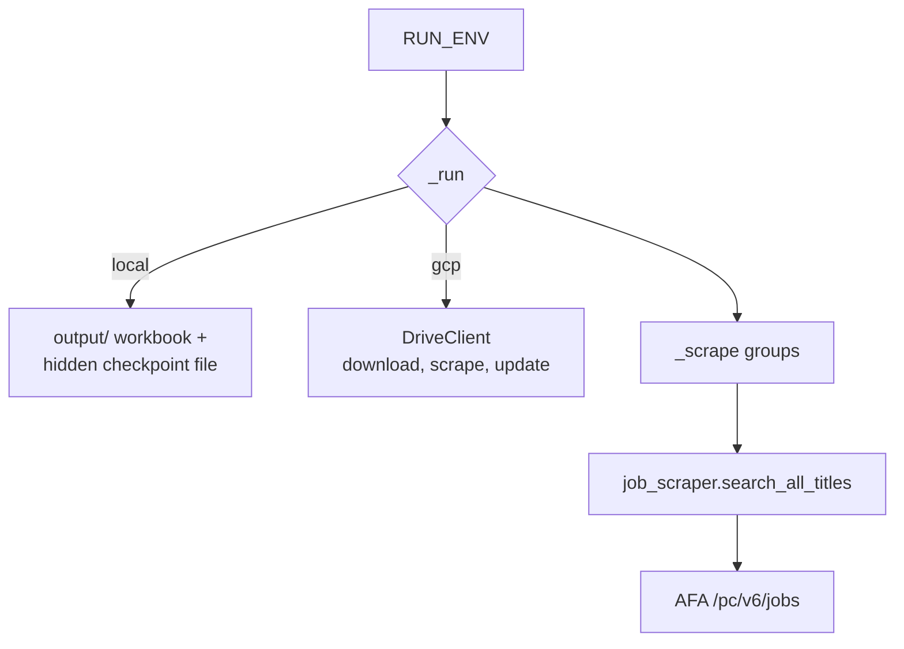

# Developer Guide — AFA Job Scraper

Technical reference for the scraper: structure, the AFA API contract, the
verification workflow, and how to extend it safely.

---

## 1. Repository layout

```
job-query-germany/
├── architecture/design-docs/           # original design notes
├── docs/
│   ├── DEPLOYMENT.md                   # Cloud Run + Scheduler walkthrough
│   ├── USER_GUIDE.md                   # running it, output format, FAQ
│   └── DEVELOPER_GUIDE.md              # this file
└── cloud-function/
    ├── main.py                         # orchestration + run-mode switching
    ├── job_scraper.py                  # AFA API client
    ├── excel_generator.py              # workbook create/append
    ├── drive_client.py                 # Google Drive wrapper (gcp mode only)
    ├── app.py                          # WSGI wrapper for Cloud Run / gunicorn
    ├── config/role_titles.json         # groups, search phrases, file name
    ├── test_incremental.py             # unit tests (offline)
    ├── requirements.txt
    ├── Dockerfile
    └── .dockerignore
```

There is exactly **one** copy of the code. Local runs and the cloud deployment
share it; only the `RUN_ENV` value differs.

---

## 2. Design: one codebase, two modes

`RUN_ENV` selects the destination at runtime:

| `RUN_ENV` | Destination | Credentials | Checkpoint stored in |
|---|---|---|---|
| `local` (default) | `./output/` on disk | none | `output/.<file>.last-success` |
| `gcp` | Google Drive folder | ADC (metadata server, or `gcloud auth application-default login`) | Drive `appProperties.lastSuccessfulRunUtc` |

The Drive client is imported **lazily**, so `RUN_ENV=local` does not require
`google-auth` / `google-api-python-client` to resolve — local work stays usable
even if the Google libraries fail to build in your environment.



### Environment variables

| Variable | Default | Applies to | Purpose |
|---|---|---|---|
| `RUN_ENV` | `local` | both | `local` or `gcp`; anything else fails fast |
| `OUTPUT_DIR` | `./output` | local | Redirect the workbook/checkpoint location |
| `DRIVE_FOLDER_ID` | config value | gcp | Overrides `drive_folder_id` so images stay environment-neutral |
| `SERVICE_ACCOUNT_JSON` | unset | gcp | Inline SA key JSON; falls back to ADC if absent or malformed |
| `PORT` | `8080` | server | Port gunicorn binds (Cloud Run injects this) |

### Lookback / checkpoint logic

`_lookback_days(last_success, run_until)` converts the checkpoint into the
integer day window the API expects:

- no checkpoint → `INITIAL_LOOKBACK_DAYS` (28 = 4 weeks, the backfill)
- otherwise → `ceil(elapsed_days)`, so partial days are rounded **up** and no
  posting can fall between two runs
- more than `MAX_LOOKBACK_DAYS` (100) → raises, rather than silently truncating
  the window and losing data

The checkpoint is written **only after a successful scrape and write**. A failed
run therefore leaves the window unchanged and the next run re-covers it; the
`refnr` de-duplication prevents duplicates.

---

## 3. The AFA API contract

Base URL: `https://rest.arbeitsagentur.de/jobboerse/jobsuche-service`
Header: `X-API-Key: jobboerse-jobsuche` (public demo key)

### Endpoint versions — the 403 trap

| Path | Result |
|---|---|
| `/pc/v6/jobs` | **200 OK** — the only working version |
| `/pc/v4/app/jobs` | **403**, empty body, for *every* request |
| `/pc/v2/app/jobs` | **403**, empty body, for *every* request |

`/pc/v4/...` and `/pc/v2/...` are retired. A 403 is also returned when the
`X-API-Key` header is missing. Because both cases look identical, `_get_page`
raises `AuthError` immediately instead of burning three retries — the error
message points at `SEARCH_PATH` and the API key.

Only `408, 425, 429, 500, 502, 503, 504` are retried (3 attempts, exponential
backoff). Every other 4xx fails fast.

### Request parameters

| Param | Value | Notes |
|---|---|---|
| `was` | search phrase | Free-text match |
| `angebotsart` | `1` | Regular employment only |
| `arbeitszeit` | `vz` | Full-time only |
| `veroeffentlichtseit` | `0`–`100` | Values above 100 are silently clamped by the API |
| `page` | `1`-based | Past the last page returns 200 with an empty list |
| `size` | `100` | **Hard limit.** `size=1000` → `400 EINGABEN_UNVOLLSTAENDIG` |

### Response shape

Top level: `ergebnisliste`, `maxErgebnisse`, `page`, `size`, `facetten`.

Per record (fields the scraper reads):

| Field | Used for |
|---|---|
| `stellenangebotsTitel` | Job Title |
| `firma` | Company Name |
| `stellenlokationen[0].adresse.ort` | Location |
| `referenznummer` | Job ID, de-duplication key, link construction |
| `eintrittszeitraum.von` | Start Date |
| `datumErsteVeroeffentlichung` | Posted Date |
| `verguetungsangabe` | Salary unit: `JAHRESGEHALT`, `STUNDENLOHN`, `MONATSGEHALT`, `TAGESLOHN`, `KEINE_ANGABEN` |
| `gehaltsspanneVon` / `gehaltsspanneBis` | Numeric salary bounds |
| `artDerVerguetung` | `GEHALTSSPANNE`, `FESTGEHALT`, or absent |

Fields are read defensively with `.get(...) or "N/A"` — the API omits keys rather
than sending nulls, so a missing company or date must not crash a run.

---

## 4. Module responsibilities

| Module | Owns | Must not |
|---|---|---|
| `main.py` | Run-mode selection, config loading, checkpoint arithmetic, orchestration, HTTP entry point | Know about Excel column order |
| `job_scraper.py` | HTTP, retries, pagination, field normalisation, salary rendering | Write files |
| `excel_generator.py` | Sheet layout, styling, links, filters, de-duplication | Perform network I/O |
| `drive_client.py` | Drive find/download/create/update, app properties | Know about workbooks' contents |
| `app.py` | WSGI surface (`/`, `/healthz`) | Contain scraping logic |

Keeping `_scrape()` returning a plain `dict[str, list[dict]]` means every module
stays testable without network access.

---

## 5. Local development

```bash
cd cloud-function/
python3.12 -m venv .venv
source .venv/bin/activate
pip install -r requirements.txt
```

### Tests

```bash
python -m unittest -v
```

26 tests, no network access — HTTP is mocked at `job_scraper.requests`. They cover
checkpoint arithmetic, `RUN_ENV` validation, salary rendering, fail-fast vs retry
behaviour, endpoint selection, pagination, and the workbook schema/filter/dedup
rules.

### Try a single phrase

```bash
python -c "
import job_scraper
for j in job_scraper.search_jobs('radar Signalverarbeitung', days=7)[:3]:
    print(j['titel'], '|', j['gehalt'], '|', j['eintrittsdatum'])
"
```

### Inspect the generated workbook without Excel

```bash
python -c "
import openpyxl
wb = openpyxl.load_workbook('output/job_listings_master.xlsx')
ws = wb[wb.sheetnames[0]]
print('filter:', ws.auto_filter.ref, '| frozen:', ws.freeze_panes)
print([c.value for c in ws[1]])
"
```

---

## 6. Container builds

```bash
# Native build for local use (arm64 on Apple Silicon)
docker build -t afa-scraper:local .

# Verify the amd64 target the way GCP needs it
docker build --platform linux/amd64 --build-arg RUN_ENV=gcp -t afa-scraper:gcp .
docker run --rm --platform linux/amd64 --entrypoint python afa-scraper:gcp \
    -c "import platform, flask, openpyxl, requests; print(platform.machine()); print('ok')"
```

The `RUN_ENV` build arg only sets the image default; the deployment overrides it.
Container behaviour is driven entirely by environment variables, so one image can
serve both modes.

`gunicorn` runs **one worker** deliberately: parallel workers in one instance
would race on the same workbook.

---

## 7. How to extend

### Add a workbook column

1. Append the header to `HEADERS` in `excel_generator.py`.
2. Add a matching width to `WIDTHS`.
3. Extend `_to_row()` in the *same position*.
4. Populate the value in `_to_row` from a key produced by `_to_job()`.
5. If the new column sits before `Link` (column F) or `Job ID` (column G), update
   the hard-coded column numbers in `_make_links()` and `_existing_refnrs()`.
6. Update the column table in `USER_GUIDE.md` and the schema test in
   `test_incremental.py`.

> Existing workbooks keep their old headers. Adding a column only affects newly
> created workbooks plus freshly appended rows, so existing files will have a
> blank trailing column.

### Add a search group or phrase

Edit `config/role_titles.json`. No code change. A new group produces a new sheet
on the next run; existing sheets are untouched.

### Change the API endpoint

Edit `SEARCH_PATH` and, if the response shape changed, `_to_job()` in
`job_scraper.py`. Verify with:

```bash
python -c "
import requests, job_scraper as js
r = requests.get(js.BASE_URL + js.SEARCH_PATH, headers=js.HEADERS,
                 params={'was':'radar','angebotsart':'1','arbeitszeit':'vz','veroeffentlichtseit':7,'page':1,'size':5})
print(r.status_code)
print(list(r.json()['ergebnisliste'][0]) if r.status_code == 200 else r.text[:200])
"
```

If a field disappears from the response, `_to_job` degrades to `N/A` — it will not
crash, but the column will go empty. Prefer making that visible in a test.

### Widen the Drive scope

`drive_client.py` requests `drive.file`, which limits the app to files it created.
To operate on a workbook uploaded by a person, change `SCOPES` to
`["https://www.googleapis.com/auth/drive"]` and re-consent the service account.

---

## 8. Conventions and gotchas

- **Fail loudly.** A run must never advance the checkpoint after a partial scrape;
  `ScrapeError` propagates instead of being swallowed into an empty list.
- **De-duplicate on `refnr`** within a sheet. Rows without a `refnr` are kept
  rather than dropped.
- **`size` is capped at 100.** Raising `PAGE_SIZE` produces HTTP 400.
- **Auto-filter must span the data**, not just row 1. A header-only range gives
  filter dropdowns that filter nothing — `_set_filter()` exists for this reason.
- **Salary figures arrive as floats** (`74999.97`). `_format_amount()` rounds
  values ≥ 1000 to whole euros and keeps one decimal for hourly rates.
- **Sheet names** are sanitised for `[ ] : * ? / \` and cut to 31 characters.
- **Style only new rows on append.** Re-styling the whole sheet on every append is
  the main avoidable cost as workbooks grow.
- **`gehalt` and `eintrittsdatum` are dictionary keys** shared between
  `job_scraper`, `excel_generator` and the tests. Renaming them requires all three.
- **`git` ignore rules** already exclude `.venv/`, `__pycache__/`,
  `cloud-function/output/` and `*.xlsx`.

---

## 9. Change checklist

Before committing a change:

```bash
cd cloud-function
python -m unittest -v                 # must pass
rm -rf output && python main.py       # must print ✅ [200] and write output/
python -c "
import openpyxl
ws = openpyxl.load_workbook('output/job_listings_master.xlsx')[openpyxl.load_workbook('output/job_listings_master.xlsx').sheetnames[0]]
print('headers:', [c.value for c in ws[1]]); print('filter:', ws.auto_filter.ref)
"
```

Then confirm:

- [ ] No endpoint path other than `/pc/v6/jobs` anywhere in the tree.
- [ ] No source edit is needed to switch run modes.
- [ ] `HEADERS`, `WIDTHS`, `_to_row()`, `USER_GUIDE.md` and the schema test agree.
- [ ] A failed scrape leaves the checkpoint untouched.
- [ ] The `Dockerfile` still builds both `linux/arm64` and `linux/amd64`.
